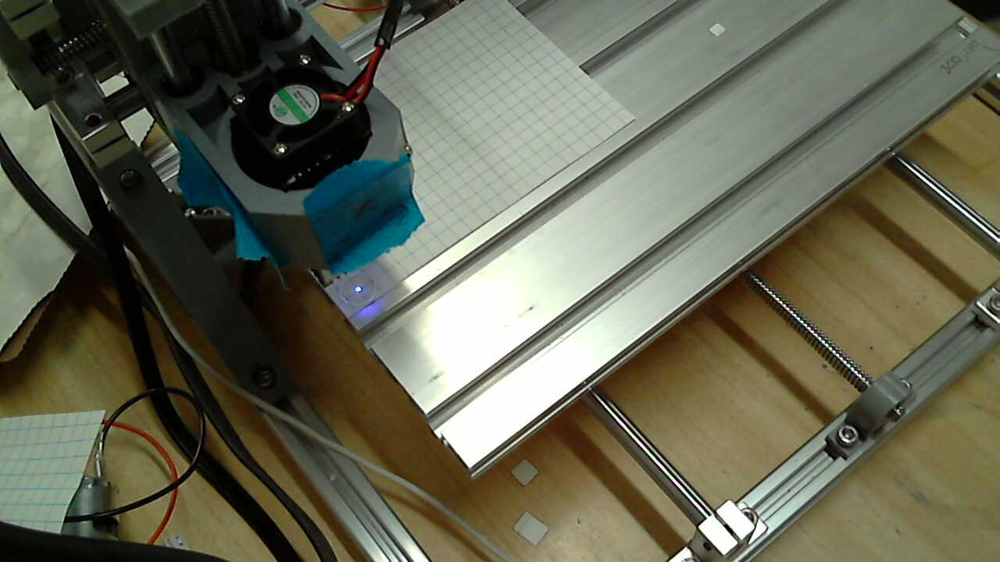

# Drawing Tests

## Object
- Play around with drawing things.

# Code:


```python
import GCode
import GRBL
import numpy as np
from utils import picture
cnc = GRBL.GRBL(port="/dev/cnc_3018")

print("Laser Mode: {}".format(cnc.laser_mode))

from enum import IntEnum
class Tool(IntEnum):
    SPINDLE = 0
    LASER = 1

from enum import IntEnum
class LaserPower(IntEnum):
    CONSTANT = 0
    DYNAMIC = 1

LaserPower.CONSTANT

def init(power_mode = LaserPower(0), feed = 200, pwm = 1):
    program = GCode.GCode()
    program.G21() # Metric Units
    program.G91() # Absolute positioning.
    program.G1(F=feed) #
    if power_mode==LaserPower.CONSTANT:
        
        program.M3(S=pwm) # Laser settings
    else:
        program.M4(S=pwm) # Laser settings
    return program

def end():
    program = GCode.GCode()
    program.M5() # Laser settings.
    return program

def square(size=0.25):    
    program = GCode.GCode()
    program.G1(X=size)
    program.G1(Y=-size)
    program.G1(X=-size)
    program.G1(Y=size)
    return program
```

    Laser Mode: 1.0


## Test Setup

Power Supply:
- CicuitSpecialists CSI3010SW @ 12V
- PostIt Note Grid notes. .25" grid.

Position the paper & other things.


```python
def laser_on(pwm):
    if int(pwm) != np.uint8(pwm):
        raise(Exception("UINT8! {}".format(pwm)))
    # Set minimal power setting to focus and position laser
    cnc.cmd("M3 S{:03d}".format(np.uint8(pwm)))
    cnc.cmd("G1 F10") # Laser On

def laser_off():
    cnc.cmd("M5") # Laser off
```


```python
cnc.cmd("$X")
```


    ['ok', 'ok']


```python
cnc.cmd("G1 F10")
```


    ['ok', 'ok']


```python
laser_on(1) # Position the axis by hand
```


```python
laser_off()
```


```python
tests_x = 10
tests_y = 7
```


```python
cnc.run(init(laser=0.1)+square(0.25))
```


    0.8319504261016846


```python
def jogx(x=10):
    program = GCode.GCode()
    program.G0(X=x)
    cnc.run(program)
def jogy(y=10):
    program = GCode.GCode()
    program.G0(Y=y)
    cnc.run(program)
def jogz(z=10):
    program = GCode.GCode()
    program.G0(Z=z)
    cnc.run(program)
```

# Test Setup


```python
picture()
```





```python
def test_program(power_mode=0, feed=100, pwm=1):
    program = GCode.GCode()
    program += init(power_mode=power_mode, pwm=pwm, feed=feed)
    negX = 0
    negZ = 0
    for dZ in [5, 5, 5, 5]:
        dX = 10
        program.G1(X=dX, Z=dZ, F=feed)
        
        negX-=dX
        negZ-=dZ
    program.G0(X=negX, Z=negZ)

    program += end()
    return program
```


```python
test_program()
```


<b>G21</b> <i></i><br>
<b>G91</b> <i></i><br>
<b>G1</b> <i>F100</i><br>
<b>M3</b> <i>S1</i><br>
<b>G1</b> <i>F100 X10 Z5</i><br>
<b>G1</b> <i>F100 X10 Z5</i><br>
<b>G1</b> <i>F100 X10 Z5</i><br>
<b>G1</b> <i>F100 X10 Z5</i><br>
<b>G0</b> <i>X-40 Z-20</i><br>
<b>M5</b> <i></i>


```python
test_program(pwm=50, feed=200)
```


<b>G21</b> <i></i><br>
<b>G91</b> <i></i><br>
<b>G1</b> <i>F200</i><br>
<b>M3</b> <i>S50</i><br>
<b>G1</b> <i>F200 X10 Z5</i><br>
<b>G1</b> <i>F200 X10 Z5</i><br>
<b>G1</b> <i>F200 X10 Z5</i><br>
<b>G1</b> <i>F200 X10 Z5</i><br>
<b>G0</b> <i>X-40 Z-20</i><br>
<b>M5</b> <i></i>


```python
# This test is going to immediately run out of Y axis. To test Ctrl-C and interrupting tests.
test_run = GCode.GCode()
for pwm in [25, 50, 255]:
    for feed in [50, 100, 250, 500, 750, 1000]:
        for power_mode in [LaserPower.CONSTANT, LaserPower.DYNAMIC]:
            test_run+= test_program(pwm=50, feed=200)
            test_run.G0(Y=10)
```


```python
test_run
```


<b>G21</b> <i></i><br>
<b>G91</b> <i></i><br>
<b>G1</b> <i>F200</i><br>
<b>M3</b> <i>S50</i><br>
<b>G1</b> <i>F200 X10 Z5</i><br>
<b>G1</b> <i>F200 X10 Z5</i><br>
<b>G1</b> <i>F200 X10 Z5</i><br>
<b>G1</b> <i>F200 X10 Z5</i><br>
<b>G0</b> <i>X-40 Z-20</i><br>
<b>M5</b> <i></i><br>
<b>G0</b> <i>Y10</i><br>
<b>G21</b> <i></i><br>
<b>G91</b> <i></i><br>
<b>G1</b> <i>F200</i><br>
<b>M3</b> <i>S50</i><br>
<b>G1</b> <i>F200 X10 Z5</i><br>
<b>G1</b> <i>F200 X10 Z5</i><br>
<b>G1</b> <i>F200 X10 Z5</i><br>
<b>G1</b> <i>F200 X10 Z5</i><br>
<b>G0</b> <i>X-40 Z-20</i><br>
<b>M5</b> <i></i><br>
<b>G0</b> <i>Y10</i><br>
<b>G21</b> <i></i><br>
<b>G91</b> <i></i><br>
<b>G1</b> <i>F200</i><br>
<b>M3</b> <i>S50</i><br>
<b>G1</b> <i>F200 X10 Z5</i><br>
<b>G1</b> <i>F200 X10 Z5</i><br>
<b>G1</b> <i>F200 X10 Z5</i><br>
<b>G1</b> <i>F200 X10 Z5</i><br>
<b>G0</b> <i>X-40 Z-20</i><br>
<b>M5</b> <i></i><br>
<b>G0</b> <i>Y10</i><br>
<b>G21</b> <i></i><br>
<b>G91</b> <i></i><br>
<b>G1</b> <i>F200</i><br>
<b>M3</b> <i>S50</i><br>
<b>G1</b> <i>F200 X10 Z5</i><br>
<b>G1</b> <i>F200 X10 Z5</i><br>
<b>G1</b> <i>F200 X10 Z5</i><br>
<b>G1</b> <i>F200 X10 Z5</i><br>
<b>G0</b> <i>X-40 Z-20</i><br>
<b>M5</b> <i></i><br>
<b>G0</b> <i>Y10</i><br>
<b>G21</b> <i></i><br>
<b>G91</b> <i></i><br>
<b>G1</b> <i>F200</i><br>
<b>M3</b> <i>S50</i><br>
<b>G1</b> <i>F200 X10 Z5</i><br>
<b>G1</b> <i>F200 X10 Z5</i><br>
<b>G1</b> <i>F200 X10 Z5</i><br>
<b>G1</b> <i>F200 X10 Z5</i><br>
<b>G0</b> <i>X-40 Z-20</i><br>
<b>M5</b> <i></i><br>
<b>G0</b> <i>Y10</i><br>
<b>G21</b> <i></i><br>
<b>G91</b> <i></i><br>
<b>G1</b> <i>F200</i><br>
<b>M3</b> <i>S50</i><br>
<b>G1</b> <i>F200 X10 Z5</i><br>
<b>G1</b> <i>F200 X10 Z5</i><br>
<b>G1</b> <i>F200 X10 Z5</i><br>
<b>G1</b> <i>F200 X10 Z5</i><br>
<b>G0</b> <i>X-40 Z-20</i><br>
<b>M5</b> <i></i><br>
<b>G0</b> <i>Y10</i><br>
<b>G21</b> <i></i><br>
<b>G91</b> <i></i><br>
<b>G1</b> <i>F200</i><br>
<b>M3</b> <i>S50</i><br>
<b>G1</b> <i>F200 X10 Z5</i><br>
<b>G1</b> <i>F200 X10 Z5</i><br>
<b>G1</b> <i>F200 X10 Z5</i><br>
<b>G1</b> <i>F200 X10 Z5</i><br>
<b>G0</b> <i>X-40 Z-20</i><br>
<b>M5</b> <i></i><br>
<b>G0</b> <i>Y10</i><br>
<b>G21</b> <i></i><br>
<b>G91</b> <i></i><br>
<b>G1</b> <i>F200</i><br>
<b>M3</b> <i>S50</i><br>
<b>G1</b> <i>F200 X10 Z5</i><br>
<b>G1</b> <i>F200 X10 Z5</i><br>
<b>G1</b> <i>F200 X10 Z5</i><br>
<b>G1</b> <i>F200 X10 Z5</i><br>
<b>G0</b> <i>X-40 Z-20</i><br>
<b>M5</b> <i></i><br>
<b>G0</b> <i>Y10</i><br>
<b>G21</b> <i></i><br>
<b>G91</b> <i></i><br>
<b>G1</b> <i>F200</i><br>
<b>M3</b> <i>S50</i><br>
<b>G1</b> <i>F200 X10 Z5</i><br>
<b>G1</b> <i>F200 X10 Z5</i><br>
<b>G1</b> <i>F200 X10 Z5</i><br>
<b>G1</b> <i>F200 X10 Z5</i><br>
<b>G0</b> <i>X-40 Z-20</i><br>
<b>M5</b> <i></i><br>
<b>G0</b> <i>Y10</i><br>
<b>G21</b> <i></i><br>
<b>G91</b> <i></i><br>
<b>G1</b> <i>F200</i><br>
<b>M3</b> <i>S50</i><br>
<b>G1</b> <i>F200 X10 Z5</i><br>
<b>G1</b> <i>F200 X10 Z5</i><br>
<b>G1</b> <i>F200 X10 Z5</i><br>
<b>G1</b> <i>F200 X10 Z5</i><br>
<b>G0</b> <i>X-40 Z-20</i><br>
<b>M5</b> <i></i><br>
<b>G0</b> <i>Y10</i><br>
<b>G21</b> <i></i><br>
<b>G91</b> <i></i><br>
<b>G1</b> <i>F200</i><br>
<b>M3</b> <i>S50</i><br>
<b>G1</b> <i>F200 X10 Z5</i><br>
<b>G1</b> <i>F200 X10 Z5</i><br>
<b>G1</b> <i>F200 X10 Z5</i><br>
<b>G1</b> <i>F200 X10 Z5</i><br>
<b>G0</b> <i>X-40 Z-20</i><br>
<b>M5</b> <i></i><br>
<b>G0</b> <i>Y10</i><br>
<b>G21</b> <i></i><br>
<b>G91</b> <i></i><br>
<b>G1</b> <i>F200</i><br>
<b>M3</b> <i>S50</i><br>
<b>G1</b> <i>F200 X10 Z5</i><br>
<b>G1</b> <i>F200 X10 Z5</i><br>
<b>G1</b> <i>F200 X10 Z5</i><br>
<b>G1</b> <i>F200 X10 Z5</i><br>
<b>G0</b> <i>X-40 Z-20</i><br>
<b>M5</b> <i></i><br>
<b>G0</b> <i>Y10</i><br>
<b>G21</b> <i></i><br>
<b>G91</b> <i></i><br>
<b>G1</b> <i>F200</i><br>
<b>M3</b> <i>S50</i><br>
<b>G1</b> <i>F200 X10 Z5</i><br>
<b>G1</b> <i>F200 X10 Z5</i><br>
<b>G1</b> <i>F200 X10 Z5</i><br>
<b>G1</b> <i>F200 X10 Z5</i><br>
<b>G0</b> <i>X-40 Z-20</i><br>
<b>M5</b> <i></i><br>
<b>G0</b> <i>Y10</i><br>
<b>G21</b> <i></i><br>
<b>G91</b> <i></i><br>
<b>G1</b> <i>F200</i><br>
<b>M3</b> <i>S50</i><br>
<b>G1</b> <i>F200 X10 Z5</i><br>
<b>G1</b> <i>F200 X10 Z5</i><br>
<b>G1</b> <i>F200 X10 Z5</i><br>
<b>G1</b> <i>F200 X10 Z5</i><br>
<b>G0</b> <i>X-40 Z-20</i><br>
<b>M5</b> <i></i><br>
<b>G0</b> <i>Y10</i><br>
<b>G21</b> <i></i><br>
<b>G91</b> <i></i><br>
<b>G1</b> <i>F200</i><br>
<b>M3</b> <i>S50</i><br>
<b>G1</b> <i>F200 X10 Z5</i><br>
<b>G1</b> <i>F200 X10 Z5</i><br>
<b>G1</b> <i>F200 X10 Z5</i><br>
<b>G1</b> <i>F200 X10 Z5</i><br>
<b>G0</b> <i>X-40 Z-20</i><br>
<b>M5</b> <i></i><br>
<b>G0</b> <i>Y10</i><br>
<b>G21</b> <i></i><br>
<b>G91</b> <i></i><br>
<b>G1</b> <i>F200</i><br>
<b>M3</b> <i>S50</i><br>
<b>G1</b> <i>F200 X10 Z5</i><br>
<b>G1</b> <i>F200 X10 Z5</i><br>
<b>G1</b> <i>F200 X10 Z5</i><br>
<b>G1</b> <i>F200 X10 Z5</i><br>
<b>G0</b> <i>X-40 Z-20</i><br>
<b>M5</b> <i></i><br>
<b>G0</b> <i>Y10</i><br>
<b>G21</b> <i></i><br>
<b>G91</b> <i></i><br>
<b>G1</b> <i>F200</i><br>
<b>M3</b> <i>S50</i><br>
<b>G1</b> <i>F200 X10 Z5</i><br>
<b>G1</b> <i>F200 X10 Z5</i><br>
<b>G1</b> <i>F200 X10 Z5</i><br>
<b>G1</b> <i>F200 X10 Z5</i><br>
<b>G0</b> <i>X-40 Z-20</i><br>
<b>M5</b> <i></i><br>
<b>G0</b> <i>Y10</i><br>
<b>G21</b> <i></i><br>
<b>G91</b> <i></i><br>
<b>G1</b> <i>F200</i><br>
<b>M3</b> <i>S50</i><br>
<b>G1</b> <i>F200 X10 Z5</i><br>
<b>G1</b> <i>F200 X10 Z5</i><br>
<b>G1</b> <i>F200 X10 Z5</i><br>
<b>G1</b> <i>F200 X10 Z5</i><br>
<b>G0</b> <i>X-40 Z-20</i><br>
<b>M5</b> <i></i><br>
<b>G0</b> <i>Y10</i><br>
<b>G21</b> <i></i><br>
<b>G91</b> <i></i><br>
<b>G1</b> <i>F200</i><br>
<b>M3</b> <i>S50</i><br>
<b>G1</b> <i>F200 X10 Z5</i><br>
<b>G1</b> <i>F200 X10 Z5</i><br>
<b>G1</b> <i>F200 X10 Z5</i><br>
<b>G1</b> <i>F200 X10 Z5</i><br>
<b>G0</b> <i>X-40 Z-20</i><br>
<b>M5</b> <i></i><br>
<b>G0</b> <i>Y10</i><br>
<b>G21</b> <i></i><br>
<b>G91</b> <i></i><br>
<b>G1</b> <i>F200</i><br>
<b>M3</b> <i>S50</i><br>
<b>G1</b> <i>F200 X10 Z5</i><br>
<b>G1</b> <i>F200 X10 Z5</i><br>
<b>G1</b> <i>F200 X10 Z5</i><br>
<b>G1</b> <i>F200 X10 Z5</i><br>
<b>G0</b> <i>X-40 Z-20</i><br>
<b>M5</b> <i></i><br>
<b>G0</b> <i>Y10</i><br>
<b>G21</b> <i></i><br>
<b>G91</b> <i></i><br>
<b>G1</b> <i>F200</i><br>
<b>M3</b> <i>S50</i><br>
<b>G1</b> <i>F200 X10 Z5</i><br>
<b>G1</b> <i>F200 X10 Z5</i><br>
<b>G1</b> <i>F200 X10 Z5</i><br>
<b>G1</b> <i>F200 X10 Z5</i><br>
<b>G0</b> <i>X-40 Z-20</i><br>
<b>M5</b> <i></i><br>
<b>G0</b> <i>Y10</i><br>
<b>G21</b> <i></i><br>
<b>G91</b> <i></i><br>
<b>G1</b> <i>F200</i><br>
<b>M3</b> <i>S50</i><br>
<b>G1</b> <i>F200 X10 Z5</i><br>
<b>G1</b> <i>F200 X10 Z5</i><br>
<b>G1</b> <i>F200 X10 Z5</i><br>
<b>G1</b> <i>F200 X10 Z5</i><br>
<b>G0</b> <i>X-40 Z-20</i><br>
<b>M5</b> <i></i><br>
<b>G0</b> <i>Y10</i><br>
<b>G21</b> <i></i><br>
<b>G91</b> <i></i><br>
<b>G1</b> <i>F200</i><br>
<b>M3</b> <i>S50</i><br>
<b>G1</b> <i>F200 X10 Z5</i><br>
<b>G1</b> <i>F200 X10 Z5</i><br>
<b>G1</b> <i>F200 X10 Z5</i><br>
<b>G1</b> <i>F200 X10 Z5</i><br>
<b>G0</b> <i>X-40 Z-20</i><br>
<b>M5</b> <i></i><br>
<b>G0</b> <i>Y10</i><br>
<b>G21</b> <i></i><br>
<b>G91</b> <i></i><br>
<b>G1</b> <i>F200</i><br>
<b>M3</b> <i>S50</i><br>
<b>G1</b> <i>F200 X10 Z5</i><br>
<b>G1</b> <i>F200 X10 Z5</i><br>
<b>G1</b> <i>F200 X10 Z5</i><br>
<b>G1</b> <i>F200 X10 Z5</i><br>
<b>G0</b> <i>X-40 Z-20</i><br>
<b>M5</b> <i></i><br>
<b>G0</b> <i>Y10</i><br>
<b>G21</b> <i></i><br>
<b>G91</b> <i></i><br>
<b>G1</b> <i>F200</i><br>
<b>M3</b> <i>S50</i><br>
<b>G1</b> <i>F200 X10 Z5</i><br>
<b>G1</b> <i>F200 X10 Z5</i><br>
<b>G1</b> <i>F200 X10 Z5</i><br>
<b>G1</b> <i>F200 X10 Z5</i><br>
<b>G0</b> <i>X-40 Z-20</i><br>
<b>M5</b> <i></i><br>
<b>G0</b> <i>Y10</i><br>
<b>G21</b> <i></i><br>
<b>G91</b> <i></i><br>
<b>G1</b> <i>F200</i><br>
<b>M3</b> <i>S50</i><br>
<b>G1</b> <i>F200 X10 Z5</i><br>
<b>G1</b> <i>F200 X10 Z5</i><br>
<b>G1</b> <i>F200 X10 Z5</i><br>
<b>G1</b> <i>F200 X10 Z5</i><br>
<b>G0</b> <i>X-40 Z-20</i><br>
<b>M5</b> <i></i><br>
<b>G0</b> <i>Y10</i><br>
<b>G21</b> <i></i><br>
<b>G91</b> <i></i><br>
<b>G1</b> <i>F200</i><br>
<b>M3</b> <i>S50</i><br>
<b>G1</b> <i>F200 X10 Z5</i><br>
<b>G1</b> <i>F200 X10 Z5</i><br>
<b>G1</b> <i>F200 X10 Z5</i><br>
<b>G1</b> <i>F200 X10 Z5</i><br>
<b>G0</b> <i>X-40 Z-20</i><br>
<b>M5</b> <i></i><br>
<b>G0</b> <i>Y10</i><br>
<b>G21</b> <i></i><br>
<b>G91</b> <i></i><br>
<b>G1</b> <i>F200</i><br>
<b>M3</b> <i>S50</i><br>
<b>G1</b> <i>F200 X10 Z5</i><br>
<b>G1</b> <i>F200 X10 Z5</i><br>
<b>G1</b> <i>F200 X10 Z5</i><br>
<b>G1</b> <i>F200 X10 Z5</i><br>
<b>G0</b> <i>X-40 Z-20</i><br>
<b>M5</b> <i></i><br>
<b>G0</b> <i>Y10</i><br>
<b>G21</b> <i></i><br>
<b>G91</b> <i></i><br>
<b>G1</b> <i>F200</i><br>
<b>M3</b> <i>S50</i><br>
<b>G1</b> <i>F200 X10 Z5</i><br>
<b>G1</b> <i>F200 X10 Z5</i><br>
<b>G1</b> <i>F200 X10 Z5</i><br>
<b>G1</b> <i>F200 X10 Z5</i><br>
<b>G0</b> <i>X-40 Z-20</i><br>
<b>M5</b> <i></i><br>
<b>G0</b> <i>Y10</i><br>
<b>G21</b> <i></i><br>
<b>G91</b> <i></i><br>
<b>G1</b> <i>F200</i><br>
<b>M3</b> <i>S50</i><br>
<b>G1</b> <i>F200 X10 Z5</i><br>
<b>G1</b> <i>F200 X10 Z5</i><br>
<b>G1</b> <i>F200 X10 Z5</i><br>
<b>G1</b> <i>F200 X10 Z5</i><br>
<b>G0</b> <i>X-40 Z-20</i><br>
<b>M5</b> <i></i><br>
<b>G0</b> <i>Y10</i><br>
<b>G21</b> <i></i><br>
<b>G91</b> <i></i><br>
<b>G1</b> <i>F200</i><br>
<b>M3</b> <i>S50</i><br>
<b>G1</b> <i>F200 X10 Z5</i><br>
<b>G1</b> <i>F200 X10 Z5</i><br>
<b>G1</b> <i>F200 X10 Z5</i><br>
<b>G1</b> <i>F200 X10 Z5</i><br>
<b>G0</b> <i>X-40 Z-20</i><br>
<b>M5</b> <i></i><br>
<b>G0</b> <i>Y10</i><br>
<b>G21</b> <i></i><br>
<b>G91</b> <i></i><br>
<b>G1</b> <i>F200</i><br>
<b>M3</b> <i>S50</i><br>
<b>G1</b> <i>F200 X10 Z5</i><br>
<b>G1</b> <i>F200 X10 Z5</i><br>
<b>G1</b> <i>F200 X10 Z5</i><br>
<b>G1</b> <i>F200 X10 Z5</i><br>
<b>G0</b> <i>X-40 Z-20</i><br>
<b>M5</b> <i></i><br>
<b>G0</b> <i>Y10</i><br>
<b>G21</b> <i></i><br>
<b>G91</b> <i></i><br>
<b>G1</b> <i>F200</i><br>
<b>M3</b> <i>S50</i><br>
<b>G1</b> <i>F200 X10 Z5</i><br>
<b>G1</b> <i>F200 X10 Z5</i><br>
<b>G1</b> <i>F200 X10 Z5</i><br>
<b>G1</b> <i>F200 X10 Z5</i><br>
<b>G0</b> <i>X-40 Z-20</i><br>
<b>M5</b> <i></i><br>
<b>G0</b> <i>Y10</i><br>
<b>G21</b> <i></i><br>
<b>G91</b> <i></i><br>
<b>G1</b> <i>F200</i><br>
<b>M3</b> <i>S50</i><br>
<b>G1</b> <i>F200 X10 Z5</i><br>
<b>G1</b> <i>F200 X10 Z5</i><br>
<b>G1</b> <i>F200 X10 Z5</i><br>
<b>G1</b> <i>F200 X10 Z5</i><br>
<b>G0</b> <i>X-40 Z-20</i><br>
<b>M5</b> <i></i><br>
<b>G0</b> <i>Y10</i><br>
<b>G21</b> <i></i><br>
<b>G91</b> <i></i><br>
<b>G1</b> <i>F200</i><br>
<b>M3</b> <i>S50</i><br>
<b>G1</b> <i>F200 X10 Z5</i><br>
<b>G1</b> <i>F200 X10 Z5</i><br>
<b>G1</b> <i>F200 X10 Z5</i><br>
<b>G1</b> <i>F200 X10 Z5</i><br>
<b>G0</b> <i>X-40 Z-20</i><br>
<b>M5</b> <i></i><br>
<b>G0</b> <i>Y10</i><br>
<b>G21</b> <i></i><br>
<b>G91</b> <i></i><br>
<b>G1</b> <i>F200</i><br>
<b>M3</b> <i>S50</i><br>
<b>G1</b> <i>F200 X10 Z5</i><br>
<b>G1</b> <i>F200 X10 Z5</i><br>
<b>G1</b> <i>F200 X10 Z5</i><br>
<b>G1</b> <i>F200 X10 Z5</i><br>
<b>G0</b> <i>X-40 Z-20</i><br>
<b>M5</b> <i></i><br>
<b>G0</b> <i>Y10</i>


```python
test_run.save("DrawingTests-Copy1.gcode")
```


```python
test_run = GCode.GCode()
```


```python
test_run.load("DrawingTests-Copy1.gcode")
```


```python
test_run.buffer[0:5]
```


    ['G21', 'G91', 'G1 F200', 'M3 S50', 'G1 F200 X10 Z5']


```python
cnc.reset()
```


```python
cnc.status
```


    '<Idle|MPos:0.000,0.000,-5.000|Bf:15,127|FS:0,0|WCO:0.000,0.000,0.000>'


```python
from time import sleep
```


```python
while 1:
    try:
        cnc.run(test_run)
        while 1:
            print(cnc.status)
            sleep(5)
    except KeyboardInterrupt as error:
        print("Feed Hold")
        cnc.cmd("!")
        print("^C")
        break
    except:
        raise
```

    .
    .
    .
    .
    .
    .
    .
    .
    .
    .
    .
    .
    .
    .
    .
    .
    .
    .
    .
    .
    .
    .
    .
    .
    .
    .
    .
    .
    .
    .
    .
    .
    .
    .
    .
    .
    .
    .
    .
    .
    .
    .
    .
    .
    .
    .
    .
    .
    .
    .
    .
    .
    .
    .
    .
    .
    .
    .
    .
    .
    .
    .
    .
    .
    .
    .
    .
    .
    .
    .
    .
    .
    .
    .
    .
    .
    .
    .
    .
    .
    .
    .
    .
    .
    .
    .
    .
    .
    .
    .
    .
    .
    .
    .
    .
    .
    .
    .
    .
    .
    .
    .
    .
    .
    .
    .
    .
    .
    .
    .
    .
    .
    .
    .
    .
    .
    .
    .
    .
    .
    .
    .
    .
    .
    .
    .
    .
    .
    .
    .
    .
    .
    .
    .
    .
    .
    .
    .
    .
    .
    .
    .
    .
    .
    .
    .
    .
    .
    .
    .
    .
    .
    .
    .
    .
    .
    .
    .
    .
    .
    .
    .
    .
    .
    .
    .
    .
    .
    .
    .
    .
    .
    .
    .
    .
    .
    .
    .
    .
    .
    .
    .
    .
    .
    .
    .
    .
    .
    .
    .
    .
    .
    .
    .
    .
    .
    .
    .
    .
    .
    .
    .
    .
    .
    .
    .
    .
    .
    .
    .
    .
    .
    .
    .
    .
    .
    .
    .
    .
    .
    .
    .
    .
    .
    .
    .
    .
    .
    .
    .
    .
    .
    .
    .
    Feed Hold
    ^C


```python
cnc.cmd("?")
# .status does not return 'ok'/'ok' when this requested on hold.
```


    ['<Hold:0|MPos:21.548,70.000,5.774|Bf:12,0|FS:0,0>']


GRBL Source that controls this string: https://github.com/gnea/grbl/blob/master/grbl/report.c

Bf = Plan block buffer available.
FS = real-time feed rate & spindle speed.

# New Test Setup!

This notebook's structure makes it much easier to run tests and debug before exceuting the tests.

- Makes it easier & safer to interrupt test (^C / interrupt)
- Saves the GCode for version control.
- 
