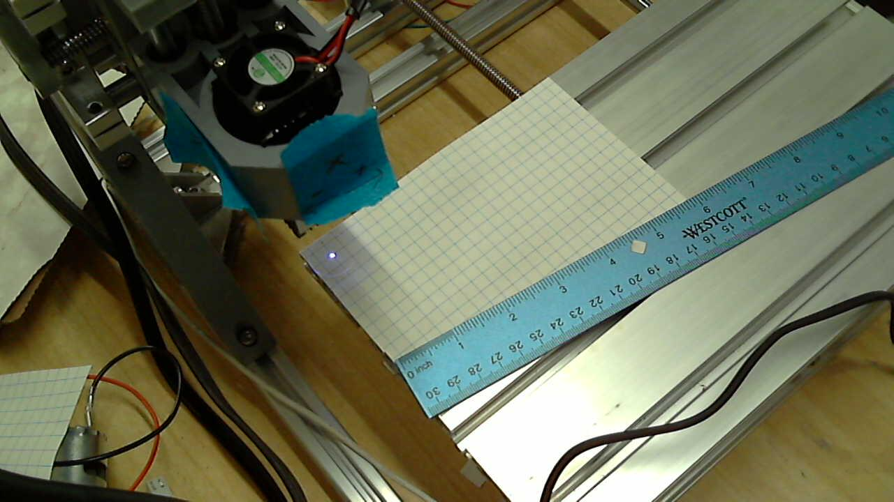

# Drawing Tests

## Object
- Play around with drawing things.

# Code:


```python
import GCode
import GRBL
import numpy as np
from utils import picture
cnc = GRBL.GRBL(port="/dev/cnc_3018")

print("Laser Mode: {}".format(cnc.laser_mode))

from enum import IntEnum
class Tool(IntEnum):
    SPINDLE = 0
    LASER = 1

from enum import IntEnum
class LaserPower(IntEnum):
    CONSTANT = 0
    DYNAMIC = 1

LaserPower.CONSTANT

def init(power = LaserPower(0), feed = 200, laser = 1):
    program = GCode.GCode()
    program.G20() # Metric Units
    program.G91() # Absolute positioning.
    program.G1(F=feed) #
    if power==LaserPower.CONSTANT:
        program.M3(S=laser) # Laser settings
    else:
        program.M4(S=laser) # Laser settings
    return program

def end():
    program = GCode.GCode()
    program.M5() # Laser settings.
    return program

def square(size=0.25):    
    program = GCode.GCode()
    program.G1(X=size)
    program.G1(Y=-size)
    program.G1(X=-size)
    program.G1(Y=size)
    return program
```

    Laser Mode: 1.0


## Test Setup

Power Supply:
- CicuitSpecialists CSI3010SW @ 12V
- PostIt Note Grid notes. .25" grid.

Position the paper & other things.


```python
def laser_on(pwm):
    if int(pwm) != np.uint8(pwm):
        raise(Exception("UINT8! {}".format(pwm)))
    # Set minimal power setting to focus and position laser
    cnc.cmd("M3 S{:03d}".format(np.uint8(pwm)))
    cnc.cmd("G1 F10") # Laser On

def laser_off():
    cnc.cmd("M5") # Laser off
```


```python
cnc.cmd("$X")
```


    ['ok', 'ok']


```python
laser_on(1) # Position the axis by hand
```


```python
laser_off()
```


```python
tests_x = 10
tests_y = 7
```


```python
cnc.run(init(laser=0.1)+square(0.25))
```


    0.8327279090881348


```python
def jogx(x=10):
    program = GCode.GCode()
    program.G0(X=x)
    cnc.run(program)
def jogy(y=10):
    program = GCode.GCode()
    program.G0(Y=y)
    cnc.run(program)
def jogz(z=10):
    program = GCode.GCode()
    program.G0(Z=z)
    cnc.run(program)
```


```python
square_size = 0.25
```

# Test Setup


```python
cnc.cmd("$G")
```


    ['ok', '[GC:G1 G54 G17 G20 G91 G94 M3 M9 T0 F5080 S0]', 'ok']


```python
cnc.cmd("$#")
```


    ['ok',
     '[G54:0.000,0.000,0.000]',
     '[G55:0.000,0.000,0.000]',
     '[G56:0.000,0.000,0.000]',
     '[G57:0.000,0.000,0.000]',
     '[G58:0.000,0.000,0.000]',
     '[G59:0.000,0.000,0.000]',
     '[G28:0.000,0.000,0.000]',
     '[G30:0.000,0.000,0.000]',
     '[G92:0.000,0.000,0.000]',
     '[TLO:0.000]',
     '[PRB:0.000,0.000,0.000:0]',
     'ok']


```python
cnc.cmd("$$")
```


    ['ok',
     '$0=10',
     '$1=25',
     '$2=0',
     '$3=5',
     '$4=0',
     '$5=0',
     '$6=0',
     '$10=3',
     '$11=0.010',
     '$12=0.002',
     '$13=0',
     '$20=0',
     '$21=1',
     '$22=0',
     '$23=0',
     '$24=25.000',
     '$25=500.000',
     '$26=250',
     '$27=1.000',
     '$30=1000',
     '$31=0',
     '$32=1',
     '$100=800.000',
     '$101=800.000',
     '$102=800.000',
     '$110=800.000',
     '$111=800.000',
     '$112=500.000',
     '$120=10.000',
     '$121=10.000',
     '$122=10.000',
     '$130=200.000',
     '$131=200.000',
     '$132=200.000',
     'ok']


```python
cnc.cmd("$I")
```


    ['ok', '[VER:1.1f.20170801:]', '[OPT:V,15,128]', 'ok']


```python
picture()
```





```python
square_size = 0.25
```


```python
for feed in np.linspace(50, 1, tests_y):
    for pwm in np.linspace(0, 100, tests_x):
        i = init(laser=np.uint8(pwm), feed=np.round(feed))
        s = square(square_size)
        cnc.run(i+s)
        jogx(square_size*2)
    jogx(-1*2*tests_x*square_size)
    jogy(-square_size*2)
```

    .
    .
    .
    .
    .
    .
    .
    .
    .
    .
    .
    .
    .
    .
    .
    .
    .
    .
    .
    .
    .
    .
    .
    .
    .
    .
    .
    .
    .
    .
    .
    .
    .
    .
    .
    .
    .
    .
    .
    .
    .
    .
    .
    .
    .
    .
    .
    .
    .
    .
    .
    .
    .
    .
    .
    .
    .
    .
    .
    .
    .
    .
    .
    .
    .
    .
    .
    .
    .
    .
    .
    .
    .
    .
    .
    .
    .
    .
    .
    .
    .
    .
    .
    .
    .
    .
    .
    .
    .
    .
    .
    .
    .
    .
    .
    .
    .
    .
    .
    .
    .
    .
    .
    .
    .
    .
    .
    .
    .
    .
    .
    .
    .
    .
    .
    .
    .
    .
    .
    .
    .
    .
    .
    .
    .
    .
    .
    .
    .
    .
    .
    .
    .
    .
    .
    .
    .
    .
    .
    .
    .
    .
    .
    .
    .
    .
    .
    .
    .
    .
    .
    .
    .
    .
    .
    .
    .
    .
    .
    .
    .
    .
    .
    .
    .
    .
    .
    .
    .
    .
    .
    .
    .
    .
    .
    .
    .
    .
    .
    .
    .
    .
    .
    .
    .
    .
    .
    .
    .
    .
    .
    .
    .
    .
    .
    .
    .
    .
    .
    .
    .
    .
    .
    .
    .
    .
    .
    .
    .
    .
    .
    .
    .
    .
    .
    .
    .
    .
    .
    .
    .
    .
    .
    .
    .
    .
    .
    .
    .
    .
    .
    .
    .
    .
    .
    .
    .
    .
    .
    .
    .
    .
    .
    .
    .
    .
    .
    .
    .
    .
    .
    .
    .
    .
    .
    .
    .
    .
    .
    .
    .
    .
    .
    .
    .
    .
    .
    .
    .
    .
    .
    .
    .
    .
    .
    .
    .
    .
    .
    .
    .
    .
    .
    .
    .
    .
    .
    .
    .
    .
    .
    .
    .
    .
    .
    .
    .
    .
    .
    .
    .
    .
    .
    .
    .
    .
    .
    .
    .
    .
    .
    .
    .
    .
    .
    .
    .
    .
    .
    .
    .
    .
    .
    .
    .
    .
    .
    .
    .
    .
    .
    .
    .
    .
    .
    .
    .
    .
    .
    .
    .
    .
    .
    .
    .
    .
    .
    .
    .
    .
    .
    .
    .
    .
    .
    .
    .
    .
    .
    .
    .
    .
    .
    .
    .
    .
    .
    .
    .
    .
    .
    .
    .
    .
    .
    .
    .
    .
    .
    .
    .
    .
    .
    .
    .
    .
    .
    .
    .
    .
    .
    .
    .
    .
    .
    .
    .
    .
    .
    .
    .
    .
    .
    .
    .
    .
    .
    .
    .
    .
    .
    .
    .
    .
    .
    .
    .
    .
    .
    .
    .
    .
    .
    .
    .
    .
    .
    .
    .
    .
    .
    .
    .
    .
    .
    .
    .
    .
    .
    .
    .
    .
    .
    .
    .
    .
    .
    .
    .
    .
    .
    .
    .
    .
    .
    .
    .
    .
    .
    .
    .
    .
    .
    .
    .
    .
    .
    .
    .
    .
    .
    .
    .
    .
    .
    .
    .
    .
    .
    .
    .
    .
    .
    .
    .
    .
    .
    .
    .
    .
    .
    .
    .
    .
    .
    .
    .
    .
    .
    .
    .
    .
    .
    .
    .
    .
    .
    .
    .
    .
    .
    .
    .
    .
    .
    .
    .
    .
    .
    .
    .
    .
    .
    .
    .
    .
    .
    .
    .
    .
    .
    .
    .
    .
    .
    .
    .
    .
    .
    .
    .
    .
    .
    .
    .
    .
    .
    .
    .
    .
    .
    .
    .
    .
    .
    .
    .
    .
    .
    .
    .
    .
    .
    .
    .
    .
    .
    .
    .
    .
    .
    .
    .
    .
    .
    .
    .
    .
    .
    .
    .
    .
    .
    .
    .
    .
    .
    .
    .
    .
    .
    .
    .
    .
    .
    .
    .
    .
    .
    .
    .
    .
    .
    .
    .
    .
    .
    .
    .
    .
    .
    .
    .
    .
    .
    .
    .
    .
    .
    .
    .
    .
    .
    .
    .
    .
    .
    .
    .
    .
    .
    .
    .
    .
    .
    .
    .
    .
    .
    .
    .
    .
    .
    .
    .
    .
    .
    .
    .
    .
    .
    .
    .
    .
    .
    .
    .
    .
    .
    .
    .
    .
    .
    .
    .
    .
    .
    .
    .
    .
    .
    .
    .
    .
    .
    .
    .
    .
    .
    .
    .
    .
    .
    .
    .
    .
    .
    .
    .
    .
    .
    .
    .
    .
    .
    .
    .
    .
    .
    .
    .
    .
    .
    .
    .
    .
    .
    .
    .
    .
    .
    .
    .
    .
    .
    .
    .
    .
    .
    .
    .
    .
    .
    .
    .
    .
    .
    .
    .
    .
    .
    .
    .
    .
    .
    .
    .
    .
    .
    .
    .
    .
    .
    .
    .
    .
    .
    .
    .
    .
    .
    .
    .
    .
    .
    .
    .
    .
    .
    .
    .
    .
    .
    .
    .
    .
    .
    .
    .
    .
    .
    .
    .
    .
    .
    .
    .
    .
    .
    .
    .
    .
    .
    .
    .
    .
    .
    .
    .
    .
    .
    .
    .
    .
    .
    .
    .
    .
    .
    .
    .
    .
    .
    .
    .
    .
    .
    .
    .
    .
    .
    .
    .
    .
    .
    .
    .
    .
    .
    .
    .
    .
    .
    .
    .
    .
    .
    .
    .
    .
    .
    .
    .
    .
    .
    .
    .
    .
    .
    .
    .
    .
    .
    .
    .
    .
    .
    .
    .
    .
    .
    .
    .
    .
    .
    .
    .
    .
    .
    .
    .
    .
    .
    .
    .
    .
    .
    .
    .
    .
    .
    .
    .
    .
    .
    .
    .
    .
    .
    .
    .
    .
    .
    .
    .
    .
    .
    .
    .
    .
    .
    .
    .
    .
    .
    .
    .
    .
    .
    .
    .
    .
    .
    .
    .
    .
    .
    .
    .
    .
    .
    .
    .
    .
    .
    .
    .
    .
    .
    .
    .
    .
    .
    .
    .
    .
    .
    .
    .
    .
    .
    .
    .
    .
    .
    .
    .
    .
    .
    .
    .
    .
    .
    .
    .
    .
    .
    .
    .
    .
    .
    .
    .
    .
    .
    .
    .
    .
    .
    .
    .
    .
    .
    .
    .
    .
    .
    .
    .
    .
    .
    .
    .
    .
    .
    .
    .
    .
    .
    .
    .
    .
    .
    .
    .
    .
    .
    .
    .
    .
    .
    .
    .
    .
    .
    .
    .
    .
    .
    .
    .
    .
    .
    .
    .
    .
    .
    .
    .
    .
    .
    .
    .
    .
    .
    .
    .
    .
    .
    .
    .
    .
    .
    .
    .
    .
    .
    .
    .
    .
    .
    .
    .
    .
    .
    .
    .
    .
    .
    .
    .
    .
    .
    .
    .
    .
    .
    .
    .
    .
    .
    .
    .
    .
    .
    .
    .
    .
    .
    .
    .
    .
    .
    .
    .
    .
    .
    .
    .
    .
    .
    .
    .
    .
    .
    .
    .
    .
    .
    .
    .
    .
    .
    .
    .
    .
    .
    .
    .
    .
    .
    .
    .
    .
    .
    .
    .
    .
    .
    .
    .
    .
    .
    .
    .
    .
    .
    .
    .
    .
    .
    .
    .
    .
    .
    .
    .
    .
    .
    .
    .
    .
    .
    .
    .
    .
    .
    .
    .
    .
    .
    .
    .
    .
    .
    .
    .
    .
    .
    .
    .
    .
    .
    .
    .
    .
    .
    .
    .
    .
    .
    .
    .
    .
    .
    .
    .
    .
    .
    .
    .
    .
    .
    .
    .
    .
    .
    .
    .
    .
    .
    .
    .
    .
    .
    .
    .
    .
    .
    .
    .
    .
    .
    .
    .
    .
    .
    .
    .
    .
    .
    .
    .
    .
    .
    .
    .
    .
    .
    .
    .
    .
    .
    .
    .
    .
    .
    .
    .
    .
    .
    .
    .
    .
    .
    .
    .
    .
    .
    .
    .
    .
    .
    .
    .
    .
    .
    .
    .
    .
    .
    .
    .
    .
    .
    .
    .
    .
    .
    .
    .
    .
    .
    .
    .
    .
    .
    .
    .
    .
    .
    .
    .
    .
    .
    .
    .
    .
    .
    .
    .
    .
    .
    .
    .
    .
    .
    .
    .
    .
    .
    .
    .
    .
    .
    .
    .
    .
    .
    .
    .
    .
    .
    .
    .
    .
    .
    .
    .
    .
    .
    .
    .
    .
    .
    .
    .
    .
    .
    .
    .
    .
    .
    .
    .
    .
    .
    .
    .
    .
    .
    .
    .
    .
    .
    .
    .
    .
    .
    .
    .
    .
    .
    .
    .
    .
    .
    .
    .
    .
    .
    .
    .
    .
    .
    .
    .
    .
    .
    .
    .
    .
    .
    .
    .
    .
    .
    .
    .
    .
    .
    .
    .
    .
    .
    .
    .
    .
    .
    .
    .
    .
    .
    .
    .
    .
    .
    .
    .
    .
    .
    .
    .
    .
    .
    .
    .
    .
    .
    .
    .
    .
    .
    .
    .
    .
    .
    .
    .
    .
    .
    .
    .
    .
    .
    .
    .
    .
    .
    .
    .
    .
    .
    .
    .
    .
    .
    .
    .
    .
    .
    .
    .
    .
    .
    .
    .
    .
    .
    .
    .
    .
    .
    .
    .
    .
    .
    .
    .
    .
    .
    .
    .
    .
    .
    .
    .
    .
    .
    .
    .
    .
    .
    .
    .
    .
    .
    .
    .
    .
    .
    .
    .
    .
    .
    .
    .
    .
    .
    .
    .
    .
    .
    .
    .
    .
    .
    .
    .
    .
    .
    .
    .
    .
    .
    .
    .
    .
    .
    .
    .
    .
    .
    .
    .
    .
    .
    .
    .
    .
    .
    .
    .
    .
    .
    .
    .
    .
    .
    .
    .
    .
    .
    .
    .
    .
    .
    .
    .
    .
    .
    .
    .
    .
    .
    .
    .
    .
    .
    .
    .
    .
    .
    .
    .
    .
    .
    .
    .
    .
    .
    .
    .
    .
    .
    .
    .
    .
    .
    .
    .
    .
    .
    .
    .
    .
    .
    .
    .
    .
    .
    .
    .
    .
    .
    .
    .
    .
    .
    .
    .
    .
    .
    .
    .
    .
    .
    .
    .
    .
    .
    .
    .
    .
    .
    .
    .
    .
    .
    .
    .
    .
    .
    .
    .
    .
    .
    .
    .
    .
    .
    .
    .
    .
    .
    .
    .
    .
    .
    .
    .
    .
    .
    .
    .
    .
    .
    .
    .
    .
    .
    .
    .
    .
    .
    .
    .
    .
    .
    .
    .
    .
    .
    .
    .
    .
    .
    .
    .
    .
    .
    .
    .
    .
    .
    .
    .
    .
    .
    .
    .
    .
    .
    .
    .
    .
    .
    .
    .
    .
    .
    .
    .
    .
    .
    .
    .
    .
    .
    .
    .
    .
    .
    .
    .
    .
    .
    .
    .
    .
    .
    .
    .
    .
    .
    .
    .
    .
    .
    .
    .
    .
    .
    .
    .
    .
    .
    .
    .
    .
    .
    .
    .
    .
    .
    .
    .
    .
    .
    .
    .
    .
    .
    .
    .
    .
    .
    .
    .
    .
    .
    .
    .
    .
    .
    .
    .
    .
    .
    .
    .
    .
    .
    .
    .
    .
    .
    .
    .
    .
    .
    .
    .
    .
    .
    .
    .
    .
    .
    .
    .
    .
    .
    .
    .
    .
    .
    .
    .
    .
    .
    .
    .
    .
    .
    .
    .
    .
    .
    .
    .
    .
    .
    .
    .
    .
    .
    .
    .
    .
    .
    .
    .
    .
    .
    .
    .
    .
    .
    .
    .
    .
    .
    .
    .
    .
    .
    .
    .
    .
    .
    .
    .
    .
    .
    .
    .
    .
    .
    .
    .
    .
    .
    .
    .
    .
    .
    .
    .
    .
    .
    .
    .
    .
    .
    .
    .
    .
    .
    .
    .
    .
    .
    .
    .
    .
    .
    .
    .
    .
    .
    .
    .
    .
    .
    .
    .
    .
    .
    .
    .
    .
    .
    .
    .
    .
    .
    .
    .
    .
    .
    .
    .
    .
    .
    .
    .
    .
    .
    .
    .
    .
    .
    .
    .
    .
    .
    .
    .
    .
    .
    .


```python
cnc.cmd("!")
```


    ['ok', 'ok']


```python
cnc.reset()
```
