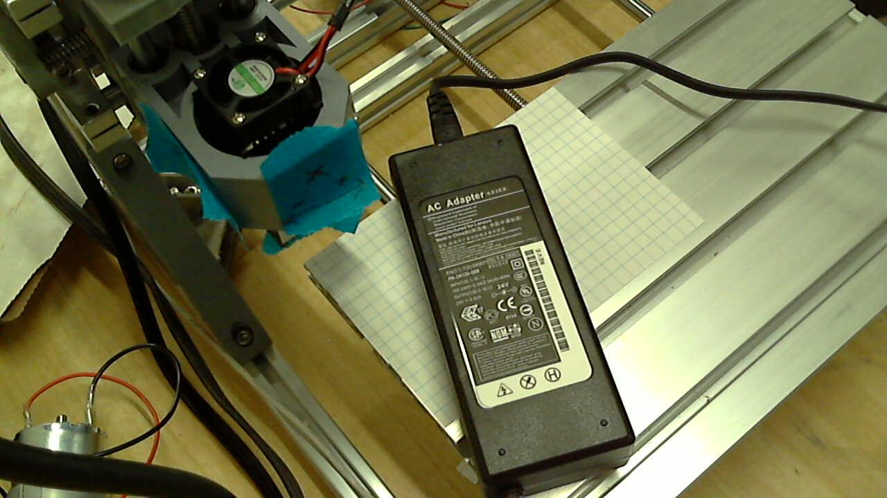

# Power Consumption Tests

## Object
- Figure out power consumption @ 24V

# Code:


```python
import GCode
import GRBL
cnc = GRBL.GRBL(port="/dev/cnc_3018")

print("Laser Mode: {}".format(cnc.laser_mode))

from enum import IntEnum
class Tool(IntEnum):
    SPINDLE = 0
    LASER = 1

from enum import IntEnum
class LaserPower(IntEnum):
    CONSTANT = 0
    DYNAMIC = 1

LaserPower.CONSTANT

def init(power = LaserPower(0), feed = 200, laser = 25):
    program = GCode.GCode()
    program.G21() # Metric Units
    program.G91() # Absolute positioning.
    program.G1(F=feed) #
    if power==LaserPower.CONSTANT:
        program.M3(S=laser) # Laser settings
    else:
        program.M4(S=laser) # Laser settings
    return program

def end():
    program = GCode.GCode()
    program.M5() # Laser settings.
    return program

def square(size=20):    
    program = GCode.GCode()
    program.G1(X=size)
    program.G1(Y=size)
    program.G1(X=-size)
    program.G1(Y=-size)
    return program
```

    Laser Mode: None


## Test Setup

Power Supply:
- CicuitSpecialists CSI3010SW

Position the paper & other things.


```python
import numpy as np
import matplotlib.pyplot as plt
```


```python
def laser_on(pwm):
    if int(pwm) != np.uint8(pwm):
        raise(Exception("UINT8! {}".format(pwm)))
    # Set minimal power setting to focus and position laser
    cnc.cmd("M3 S{:03d}".format(np.uint8(pwm)))
    cnc.cmd("G1 X0 F10") # Laser On

def laser_off():
    cnc.cmd("M5") # Laser off
```


```python
voltage = 24
# TODO: 
# import powersupply
# powersupply.voltage(24)

current = list()
results = list()
for laser_pwm in [0, 10, 25, 50, 100, 150, 200, 255]:
    result = dict()
    result["laser_pwm"] = laser_pwm
    result["voltage"] = voltage
    laser_on(laser_pwm)
    result["current"] = input("{}V. PWM: {}. Current Output (A):".format(voltage,laser_pwm))
    results.append(result)
laser_off()
results
```

    24V. PWM: 0. Current Output (A):.24
    24V. PWM: 10. Current Output (A):.37
    24V. PWM: 25. Current Output (A):.50
    24V. PWM: 50. Current Output (A):.69
    24V. PWM: 100. Current Output (A):.80
    24V. PWM: 150. Current Output (A):


    ---------------------------------------------------------------------------

    UnicodeDecodeError                        Traceback (most recent call last)

    <ipython-input-5-c58405f812a4> in <module>()
         10     result["laser_pwm"] = laser_pwm
         11     result["voltage"] = voltage
    ---> 12     laser_on(laser_pwm)
         13     result["current"] = input("{}V. PWM: {}. Current Output (A):".format(voltage,laser_pwm))
         14     results.append(result)


    <ipython-input-4-b171da4ffaac> in laser_on(pwm)
          4     # Set minimal power setting to focus and position laser
          5     cnc.cmd("M3 S{:03d}".format(np.uint8(pwm)))
    ----> 6     cnc.cmd("G1 X0 F10") # Laser On
          7 
          8 def laser_off():


    ~/python_cnc3018/python_rs274/GRBL/__init__.py in cmd(self, command_line, resp, multiline)
         48         self.write(command_line)
         49         if resp:
    ---> 50             return self.read(multiline=multiline)
         51         return None
         52 


    ~/python_cnc3018/python_rs274/GRBL/__init__.py in read(self, multiline, timeout)
         36         if multiline:
         37             responses = self.serial.readlines()
    ---> 38             responses = [response.decode().strip() for response in responses]
         39             return responses
         40         else:


    ~/python_cnc3018/python_rs274/GRBL/__init__.py in <listcomp>(.0)
         36         if multiline:
         37             responses = self.serial.readlines()
    ---> 38             responses = [response.decode().strip() for response in responses]
         39             return responses
         40         else:


    UnicodeDecodeError: 'utf-8' codec can't decode byte 0xa1 in position 1279: invalid start byte


# Reset!

This is the issue that people are running to online and that I ran into earlier when testing the laser.

Above a certain laser power @ 24V the whole controller resets. This happened at 24V PWM=100. It registered 0.8A for a few seconds then reset.

The device was provided with a 24V Laptop power supply:


```python
from utils import picture
```


```python
picture()
```





The laser control board has a 12V in and a TTL port. But only the 12V cord is provided. The "Woodpecker 2.6" control board has a [IRF540NS](http://www.irf.com/product-info/datasheets/data/irf540ns.pdf) power MOSFET.

12V to the "TTL" doesn't let out any magic smoke.

Hooking the "Laser" connector to TTL and 12V to 12V draws a lot of current and melts power cables. But doesn't let any smoke out.

## Run device at 12V for now...
