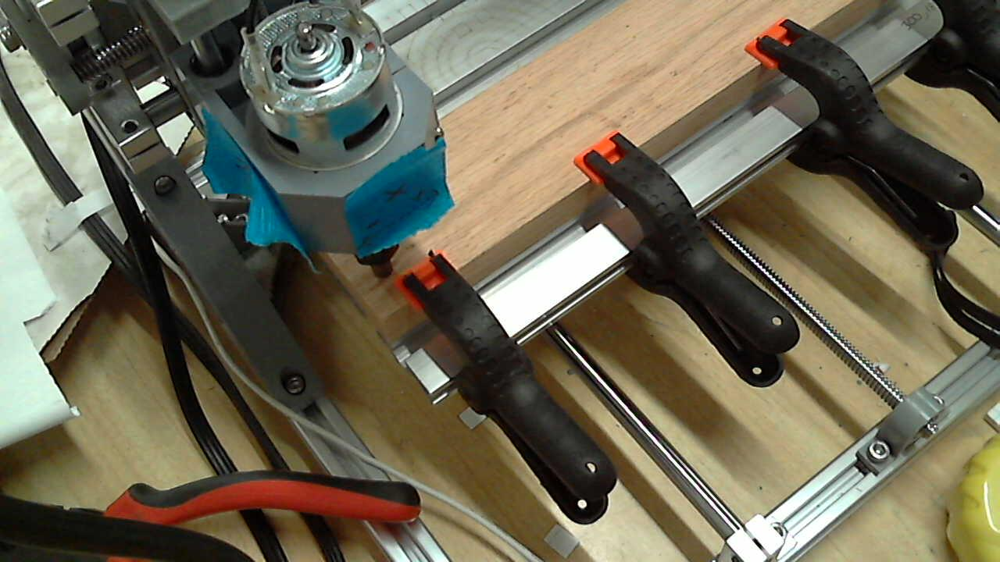
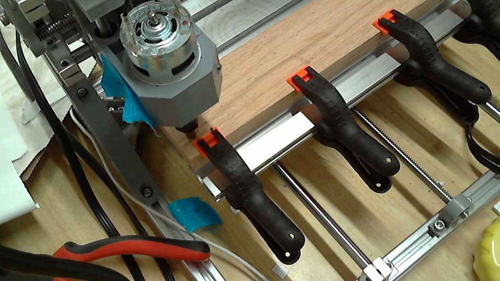
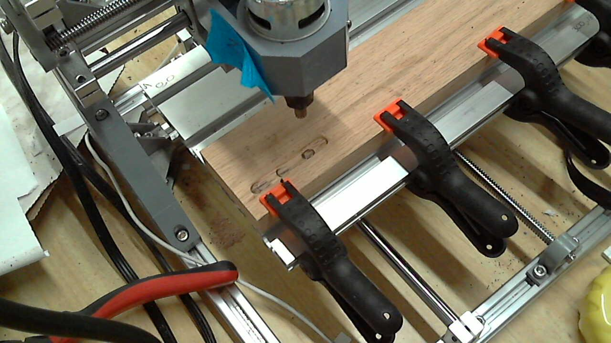

# Spindle Cutting Tests

## Object
- Play around with Dremel High Speed Cutter 115 in the ER11 spindle

# Code:


```python
import GCode
import GRBL
import numpy as np
from utils import picture
cnc = GRBL.GRBL(port="/dev/cnc_3018")
```


```python
print("Laser Mode: {}".format(cnc.laser_mode))
```

    Laser Mode: 0.0


```python
def init(feed = 200):
    program = GCode.GCode()
    program.G21() # Metric Units
    program.G91() # Absolute positioning.
    program.G1(F=feed) 
    return program

def end():
    program = GCode.GCode()
    return program
```

## Test Setup


```python
cnc.cmd("$X")
```


    ['ok', 'ok']


```python
def jogx(x=10):
    program = GCode.GCode()
    program.G0(X=x)
    cnc.run(program)
def jogy(y=10):
    program = GCode.GCode()
    program.G0(Y=y)
    cnc.run(program)
def jogz(z=10):
    program = GCode.GCode()
    program.G0(Z=z)
    cnc.run(program)
```

# Test Setup


```python
picture()
```





# Test Setup

- Oak Board 63mm x 300mm x 19mm
- Dremel High Speed Cutter "Carving / Engraving" 115.
- 28.8V . Coarse cranked up. Fine Knob in middle.


```python
def test_program(feed=200):
    prog = GCode.GCode()
    prog.G0(Z=-2)
    dZ = -1
    dX = 20
    X = 0
    Z = 0
    for loops in range(10):
        prog.M3(S=10000)
        prog.G1(Z=dZ, F=10)
        prog.G1(X=dX, F=feed)
        X+=dX
        Z+=dZ
    prog.M3(S=0)
    prog.G0(Z=-Z)
    prog.G0(X=-X)
    prog.G0(Z=2)
    return prog
```


```python
test_program()
```


<b>G0</b> <i>Z-2</i><br>
<b>M3</b> <i>S10000</i><br>
<b>G1</b> <i>Z-1 F10</i><br>
<b>G1</b> <i>X20 F200</i><br>
<b>M3</b> <i>S10000</i><br>
<b>G1</b> <i>Z-1 F10</i><br>
<b>G1</b> <i>X20 F200</i><br>
<b>M3</b> <i>S10000</i><br>
<b>G1</b> <i>Z-1 F10</i><br>
<b>G1</b> <i>X20 F200</i><br>
<b>M3</b> <i>S10000</i><br>
<b>G1</b> <i>Z-1 F10</i><br>
<b>G1</b> <i>X20 F200</i><br>
<b>M3</b> <i>S10000</i><br>
<b>G1</b> <i>Z-1 F10</i><br>
<b>G1</b> <i>X20 F200</i><br>
<b>M3</b> <i>S10000</i><br>
<b>G1</b> <i>Z-1 F10</i><br>
<b>G1</b> <i>X20 F200</i><br>
<b>M3</b> <i>S10000</i><br>
<b>G1</b> <i>Z-1 F10</i><br>
<b>G1</b> <i>X20 F200</i><br>
<b>M3</b> <i>S10000</i><br>
<b>G1</b> <i>Z-1 F10</i><br>
<b>G1</b> <i>X20 F200</i><br>
<b>M3</b> <i>S10000</i><br>
<b>G1</b> <i>Z-1 F10</i><br>
<b>G1</b> <i>X20 F200</i><br>
<b>M3</b> <i>S10000</i><br>
<b>G1</b> <i>Z-1 F10</i><br>
<b>G1</b> <i>X20 F200</i><br>
<b>M3</b> <i>S0</i><br>
<b>G0</b> <i>Z10</i><br>
<b>G0</b> <i>X-200</i><br>
<b>G0</b> <i>Z2</i>


```python
from IPython.core.magic import register_cell_magic
@register_cell_magic
def CNC(_, cell):
    commands = cell.splitlines()
    cnc.run(commands)
    return None
```


```python
%%CNC
G1 F100
G1 Y+10
```


```python
# This test is going to immediately run out of Y axis. To test Ctrl-C and interrupting tests.
test_run = GCode.GCode()
# Lower head to touching part.
# Then lift by 2.
test_run.G0(Z=2)
for XFeed in [100, 250, 500]:
    test_run += test_program(feed=XFeed)
```


```python
test_run
```


<b>G0</b> <i>Z2</i><br>
<b>G0</b> <i>Z-2</i><br>
<b>M3</b> <i>S10000</i><br>
<b>G1</b> <i>Z-1 F10</i><br>
<b>G1</b> <i>X20 F100</i><br>
<b>M3</b> <i>S10000</i><br>
<b>G1</b> <i>Z-1 F10</i><br>
<b>G1</b> <i>X20 F100</i><br>
<b>M3</b> <i>S10000</i><br>
<b>G1</b> <i>Z-1 F10</i><br>
<b>G1</b> <i>X20 F100</i><br>
<b>M3</b> <i>S10000</i><br>
<b>G1</b> <i>Z-1 F10</i><br>
<b>G1</b> <i>X20 F100</i><br>
<b>M3</b> <i>S10000</i><br>
<b>G1</b> <i>Z-1 F10</i><br>
<b>G1</b> <i>X20 F100</i><br>
<b>M3</b> <i>S10000</i><br>
<b>G1</b> <i>Z-1 F10</i><br>
<b>G1</b> <i>X20 F100</i><br>
<b>M3</b> <i>S10000</i><br>
<b>G1</b> <i>Z-1 F10</i><br>
<b>G1</b> <i>X20 F100</i><br>
<b>M3</b> <i>S10000</i><br>
<b>G1</b> <i>Z-1 F10</i><br>
<b>G1</b> <i>X20 F100</i><br>
<b>M3</b> <i>S10000</i><br>
<b>G1</b> <i>Z-1 F10</i><br>
<b>G1</b> <i>X20 F100</i><br>
<b>M3</b> <i>S10000</i><br>
<b>G1</b> <i>Z-1 F10</i><br>
<b>G1</b> <i>X20 F100</i><br>
<b>M3</b> <i>S0</i><br>
<b>G0</b> <i>Z10</i><br>
<b>G0</b> <i>X-200</i><br>
<b>G0</b> <i>Z2</i><br>
<b>G0</b> <i>Z-2</i><br>
<b>M3</b> <i>S10000</i><br>
<b>G1</b> <i>Z-1 F10</i><br>
<b>G1</b> <i>X20 F250</i><br>
<b>M3</b> <i>S10000</i><br>
<b>G1</b> <i>Z-1 F10</i><br>
<b>G1</b> <i>X20 F250</i><br>
<b>M3</b> <i>S10000</i><br>
<b>G1</b> <i>Z-1 F10</i><br>
<b>G1</b> <i>X20 F250</i><br>
<b>M3</b> <i>S10000</i><br>
<b>G1</b> <i>Z-1 F10</i><br>
<b>G1</b> <i>X20 F250</i><br>
<b>M3</b> <i>S10000</i><br>
<b>G1</b> <i>Z-1 F10</i><br>
<b>G1</b> <i>X20 F250</i><br>
<b>M3</b> <i>S10000</i><br>
<b>G1</b> <i>Z-1 F10</i><br>
<b>G1</b> <i>X20 F250</i><br>
<b>M3</b> <i>S10000</i><br>
<b>G1</b> <i>Z-1 F10</i><br>
<b>G1</b> <i>X20 F250</i><br>
<b>M3</b> <i>S10000</i><br>
<b>G1</b> <i>Z-1 F10</i><br>
<b>G1</b> <i>X20 F250</i><br>
<b>M3</b> <i>S10000</i><br>
<b>G1</b> <i>Z-1 F10</i><br>
<b>G1</b> <i>X20 F250</i><br>
<b>M3</b> <i>S10000</i><br>
<b>G1</b> <i>Z-1 F10</i><br>
<b>G1</b> <i>X20 F250</i><br>
<b>M3</b> <i>S0</i><br>
<b>G0</b> <i>Z10</i><br>
<b>G0</b> <i>X-200</i><br>
<b>G0</b> <i>Z2</i><br>
<b>G0</b> <i>Z-2</i><br>
<b>M3</b> <i>S10000</i><br>
<b>G1</b> <i>Z-1 F10</i><br>
<b>G1</b> <i>X20 F500</i><br>
<b>M3</b> <i>S10000</i><br>
<b>G1</b> <i>Z-1 F10</i><br>
<b>G1</b> <i>X20 F500</i><br>
<b>M3</b> <i>S10000</i><br>
<b>G1</b> <i>Z-1 F10</i><br>
<b>G1</b> <i>X20 F500</i><br>
<b>M3</b> <i>S10000</i><br>
<b>G1</b> <i>Z-1 F10</i><br>
<b>G1</b> <i>X20 F500</i><br>
<b>M3</b> <i>S10000</i><br>
<b>G1</b> <i>Z-1 F10</i><br>
<b>G1</b> <i>X20 F500</i><br>
<b>M3</b> <i>S10000</i><br>
<b>G1</b> <i>Z-1 F10</i><br>
<b>G1</b> <i>X20 F500</i><br>
<b>M3</b> <i>S10000</i><br>
<b>G1</b> <i>Z-1 F10</i><br>
<b>G1</b> <i>X20 F500</i><br>
<b>M3</b> <i>S10000</i><br>
<b>G1</b> <i>Z-1 F10</i><br>
<b>G1</b> <i>X20 F500</i><br>
<b>M3</b> <i>S10000</i><br>
<b>G1</b> <i>Z-1 F10</i><br>
<b>G1</b> <i>X20 F500</i><br>
<b>M3</b> <i>S10000</i><br>
<b>G1</b> <i>Z-1 F10</i><br>
<b>G1</b> <i>X20 F500</i><br>
<b>M3</b> <i>S0</i><br>
<b>G0</b> <i>Z10</i><br>
<b>G0</b> <i>X-200</i><br>
<b>G0</b> <i>Z2</i>


```python
gcode_file = "SpindleTests.gcode"
```


```python
test_run.save(gcode_file)

del test_run
test_run = GCode.GCode()

test_run.load(gcode_file)
```


```python
test_run.buffer[0:5]
```


    ['G0 Z2', 'G0 Z-2', 'M3 S10000', 'G1 Z-1 F10', 'G1 X20 F100']


```python
picture()
```





```python
while 1:
    try:
        cnc.run(test_run)
        while 1:
            print(cnc.status)
            sleep(5)
    except KeyboardInterrupt as error:
        print("Feed Hold")
        cnc.cmd("!")
        print("^C")
        break
    except:
        raise
```

    ^C


    ---------------------------------------------------------------------------

    AssertionError                            Traceback (most recent call last)

    <ipython-input-52-c54c312fb5fd> in <module>()
          3         cnc.run(test_run)
          4         while 1:
    ----> 5             print(cnc.status)
          6             sleep(5)
          7     except KeyboardInterrupt as error:


    ~/CNC3018/python_rs274/GRBL/__init__.py in status(self)
         68         """
         69         ret = self.cmd("?")
    ---> 70         assert(ret[-1] == 'ok')
         71         return ret[1]
         72 


    AssertionError: 


```python
picture()
```





# Test Aborted.

Cuts were way too aggressive.
