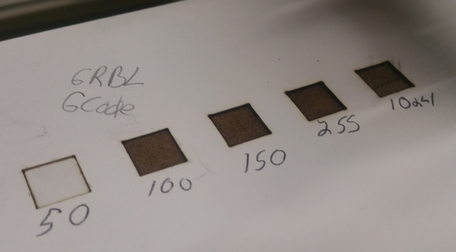
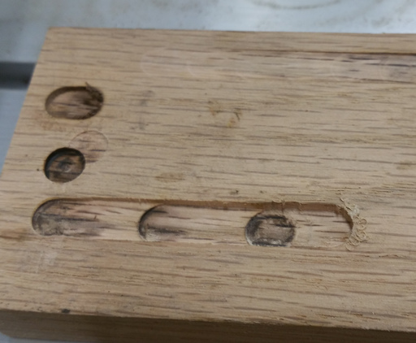
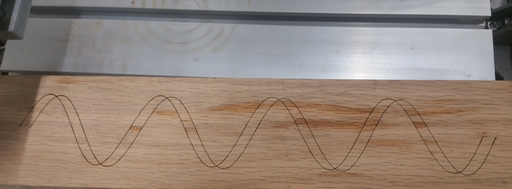

# Python CNC3018

# Installation

git clone --recurse-submodules --branch {{branch}} {{https_url}}
cd {{project}}

## Setup environment

Setup the host, only needs done once per host.

# Set up the host with required packages.
sudo make env.host

Setup Environment.

# Setup environment.
# The first time this runs it takes a while.
make env

## Activate environment.

[Pick one]

- `source bin/activate` # Bash
- `source bin/activate.csh` # C Shells
- `call Scripts\activate.bat` # Windows


## Cleaning Environment.

make clean

### [Optional]

Copy udev rules to alias the CNC device to `/dev/cnc_3018`, `/dev/grbl_3018`, and `/dev/grbl`.

sudo cp 42-cnc.rules /etc/udev/rules.d/
sudo udevadm control --reload-rules
sudo udevadm trigger

# Pictures

Pictures of some outputs produced by these modules.

Testing laser intensity:



Testing feedrate:



Numpy to generate sine wave:




# Motivation

# Motivation

I purchased a [Aliexpress CNC3018](https://www.aliexpress.com/wholesale?SearchText=CNC+3018) cnc/engraver/mill/laser machine and started playing with it. The hardware is ok but the software provided is terrible and Windows only.

The machine itself runs on a custom Arduino board running [grbl](https://github.com/gnea/grbl) *an open source, embedded, high performance g-code-parser and CNC milling controller written in optimized C*.

I wanted teach myself [G-code](https://en.wikipedia.org/wiki/G-code) and learn the low level commands and how they operated the machine.

Trying out different machine settings (Laser power, feed rate) is a very tedious and repetitive process. Being able to put it in a ```for``` loop has allowed me to figure out best settings for  laser burning on different materials.

```python_grbl``` is a Python module for interacting and interfacing with a grbl device.

```python_gcode``` is a Python module for creating Gcode from Python.

Both are still very in their infancy. I'm spending more time using them and less time developing them, so I hope they are available for public consumption.

Pull requests are encouraged.

# Examples:

## grbl

Create a GRBL instance. ```port``` is the GRBL board serial devie.


import GRBL
grbl = GRBL.GRBL(port = "/dev/cnc_3018")

# Get laser_mode
print(grbl.laser_mode)
1.0

# Turn off laser_mode
grbl.laser_mode=0

Resetting Grbl:

grbl.cmd("\x18") # ^R
grbl.reset()

Send something to Grbl:

# $$ and $x=val - View and write Grbl settings
grbl.cmd("$$")

$G - View gcode parser state
grbl.cmd("$G")

# Jog to position X=0, Y=0

grbl.cmd("G0X0Y0")

# Set mm mode.

grbl.cmd("G1")

Most of the [Grbl settings](https://github.com/gnea/grbl/wiki/Grbl-v1.1-Configuration#grbl-settings) are added as object parameters.

# Get the Grbl settings w/cmd
grbl.cmd("$$")

# Get laser mode ($32)

grbl.laser_mode

# Set laser mode.

grbl.laser_mode = 1

Run a GCode program or list of commands.

grbl.run(["G21", "G91", "G1 X5 Y5 F100"])

## GCode

Programatically create [G-Code programs](https://en.wikipedia.org/wiki/G-code) with Python.

program = GCode.GCode()
program.G0(X=0, Y=0) # Jog to (0, 0).

Program to draw a square:

def square(size=20):
program = GCode.GCode()
program.G1(X=size) # Move in the X direction by 'size'
program.G1(Y=size) # Move in the Y direction by 'size'
program.G1(X=-size)# Move in the X direction by -'size'
program.G1(Y=-size)# Move in the Y direction by -'size'
return program

Draw sine wave:

X = np.arange(0, 2*4*np.pi*10, 1) # mm
test_run = GCode.GCode()
# Move head to initial position in X.
# When doing absolute
test_run.G0(X=X[0])
test_run.M4(S=255)
for x in X:
y = 20*np.sin(x/10)
# Keep GRBL happy.
x = np.round(x, 4)
y = np.round(y, 4)

test_run.G1(X=x, Y=y)

Save program to gcode file.

test_run.save('my.gcode')

Load gcode file to instance:

test_run.load('my.gcode')

## GRBL & GCode

Combining the above:

cnc = GRBL.GRBL(port="/dev/cnc_3018")

Create init & end programs:

def init(feed = 10):
program = GCode.GCode() # Create GCode instance.
program.G21() # Metric Units
program.G91() # Absolute positioning.
program.G1(F=feed) # Set G1 feed rate.
return program # Return program

def end():
program = GCode.GCode() # Create GCode instance
return program

Square Program:

def square(size=10, power=1):
program = GCode.GCode()
program.M3(S=power) # Laser on full power
program.G1(X=size) # Draw square.
program.G1(Y=-size)
program.G1(X=-size)
program.G1(Y=size)
program.M5() # Laser on.
return program

Create a program to draw a row of boxes testing feed speeds on laser engraving.

size = 10 # mm
program = GCode.GCode()
for feed in [50, 100, 200, 500]:
program += init(feed=feed)
program += square(size=size, power=255)
program.G0(X=size*2)

program += end()
cnc.run(program);

Create a program to draw a row of boxes testing laser power:

size = 10 # mm
program = GCode.GCode()
for power in [50, 100, 200, 500]:
program += init(feed=100)
program += square(size=size, power=power)
program.G0(X=size*2)

program += end()
cnc.run(program);

# Installation

Clone repository:

git clone https://github.com/jed-frey/CNC3018.git
cd CNC3018

Install tools to generate markdown and pdfs. [optional]

# Install Debian/Ubuntu packages for generating PDFs & Markdown.
make dev

or

# For generating PDFs and Markdown.
sudo apt-get install texlive-xetex pandoc
# For udev.
sudo cp 42-cnc.rules /etc/udev/rules.d/

Create virtual environment. [optional]

make venv


# TODO

1. Documentation.
1. Validate GCode.
1. More examples.
1. 3D Printer GCode.
