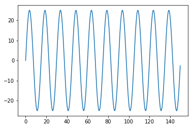

# Numpy with Lasers.


```python
import numpy as np
import GCode
import GRBL

cnc = GRBL.GRBL(port="/dev/cnc_3018")

print("Laser Mode: {}".format(cnc.laser_mode))
```

    Laser Mode: 1.0


```python
from enum import IntEnum
class LaserPower(IntEnum):
    CONSTANT = 0
    DYNAMIC = 1
    
def init(power = LaserPower(0), feed = 200, laser = 25):
    program = GCode.GCode()
    program.G21() # Metric Units
    program.G91() # Rel positioning.
    program.G1(F=feed) # Set the feed rate
    program.G0() # But keep the laser off.
    if power==LaserPower.CONSTANT:
        program.M3(S=laser) # Laser settings
    else:
        program.M4(S=laser) # Laser settings
    return program

def end():
    program = GCode.GCode()
    program.M5() # Te
    return program
```


```python
Tmax = 150
T = np.arange(0, Tmax, 0.25)
```


```python
# Plot Cycles
cycles = 10
```


```python
T_period = Tmax / cycles
freq_hz = 1/T_period
```


```python
amplitude = 25
phase = 0
```


```python
%matplotlib inline
```


```python
import matplotlib.pyplot as plt
```


```python
Y = amplitude*np.sin(2*np.pi*freq_hz*T + phase)
```


```python
plt.plot(T, Y)
```


    [<matplotlib.lines.Line2D at 0x7f99d1e65f98>]





```python
dT, dY = np.diff((T, Y))
```


```python
cnc_sin = GCode.GCode()
for idx in range(len(dT)):
    cnc_sin.G1(X="{:.4f}".format(dT[idx]),
               Y="{:.4f}".format(dY[idx]))
```


```python
class SoftKill(Exception):
    pass
```


```python
try:
    cnc.run(init(laser=255))
    cnc.run(cnc_sin)
    cnc.run(end())
except KeyboardInterrupt:
    cnc.serial.flushOutput()
    cnc.cmd("!")
    cnc.reset()
    raise(SoftKill("Keyboard"))
```

    .
    .
    .
    .
    .
    .
    .
    .
    .
    .
    .
    .
    .
    .
    .
    .
    .
    .
    .
    .
    .
    .
    .
    .
    .
    .
    .
    .
    .
    .
    .
    .
    .
    .
    .
    .
    .
    .
    .
    .
    .
    .
    .
    .
    .
    .
    .
    .
    .
    .
    .
    .
    .
    .
    .
    .
    .
    .
    .
    .
    .
    .
    .
    .
    .
    .
    .
    .
    .
    .
    .
    .
    .
    .
    .
    .
    .
    .
    .
    .
    .
    .
    .
    .
    .
    .
    .
    .
    .
    .
    .
    .
    .
    .
    .
    .
    .
    .
    .
    .
    .
    .
    .
    .
    .
    .
    .
    .
    .
    .


    ---------------------------------------------------------------------------

    KeyboardInterrupt                         Traceback (most recent call last)

    <ipython-input-16-43c7226be5a3> in <module>()
          2     cnc.run(init(laser=255))
    ----> 3     cnc.run(cnc_sin)
          4     cnc.run(end())


    ~/python_cnc3018/python_rs274/GRBL/__init__.py in run(self, program, compact)
        120                 print(".")
    --> 121                 results = self.read(multiline=True, timeout=0.1)
        122 


    ~/python_cnc3018/python_rs274/GRBL/__init__.py in read(self, multiline, timeout)
         36         if multiline:
    ---> 37             responses = self.serial.readlines()
         38             responses = [response.decode().strip() for response in responses]


    ~/.venv3/lib/python3.5/site-packages/serial/serialposix.py in read(self, size)
        482             try:
    --> 483                 ready, _, _ = select.select([self.fd, self.pipe_abort_read_r], [], [], timeout.time_left())
        484                 if self.pipe_abort_read_r in ready:


    KeyboardInterrupt: 

    
    During handling of the above exception, another exception occurred:


    AssertionError                            Traceback (most recent call last)

    <ipython-input-16-43c7226be5a3> in <module>()
          6     cnc.serial.flushOutput()
          7     cnc.cmd("!")
    ----> 8     cnc.reset()
          9     raise(SoftKill("Keyboard"))


    ~/python_cnc3018/python_rs274/GRBL/__init__.py in reset(self)
         55         """
         56         ret = self.cmd("\x18")
    ---> 57         assert(ret[-1] == 'ok')
         58 
         59     def sleep(self):


    AssertionError: 


```python

```
